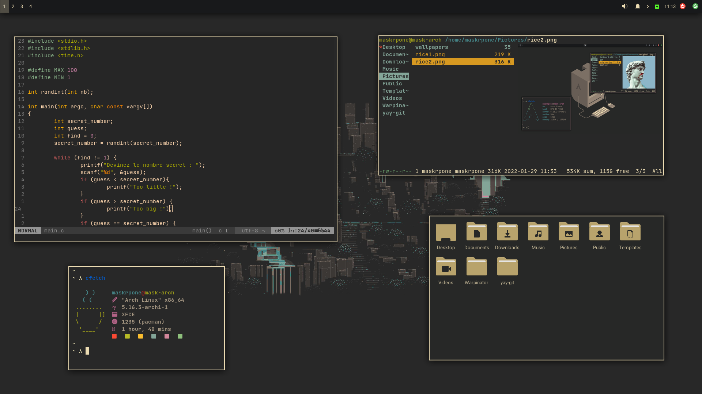

# trying something new here theme
<h3>Gruvbox-inspired theme</h3>
This theme is for xfce.<br><br>
You will find here the global theme and the Window Manager theme<br><br>


<h3>Installation</h2>

First, you have to clone this repository :

```bash
git clone https://github.com/Maskrpone/trying-something-new-here-theme.git
```
Then cd into the folder :

```bash
cd trying-something-new-here-theme/
```
And lastly, move the two folder in your theme folder :

```bash
mv trying-something-here-xfwm/ $USER/.local/share/theme
```
```bash
mv trying_something_here/ $USER/.local/share/theme
```
You'll have next to apply it in your settings.<br><br>
If by any chance the top of window frame is showing some irregularities (like black pixels), it is just the titlebar.<br><br>
By changing the font and the size of the font of the titlbar, you will make it disappear. Mine is fixed on "Sans bold" size 1. <br><br>

<h3>Cfetch, the fetching tool used in the picture is not of my creation, you can find it <a href="https://github.com/Dyzean/coffee-fetch" target="_blank">here</a></h3>
<h3>I made the xfwm theme based on another xfwm theme that you will find <a href="https://github.com/addy-dclxvi/Xfwm4-Theme-Collections" target="_blank">here</a>.</h3>
